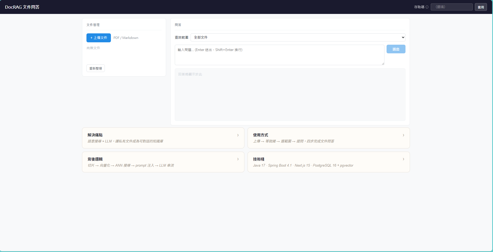

# docrag — RAG 文件問答系統（Beta）




## 補充

> 採 SDD 形式，令 Claude code 依 [RAG 方案 A 技術規格 v1.2](docs/SPEC.md) 實作的向量文件知識庫**全端**。

## What is this

這是一個輕量化的企業內部文件知識庫系統，概念類似 NotebookLM，但聚焦於「可自建、可控管、可內部部署」。

系統透過 RAG（Retrieval-Augmented Generation）架構，將企業文件（如 PDF、規範文件、報告）轉換為向量資料，並提供自然語言查詢能力。

使用者可以直接用「問問題」的方式，快速取得文件中的重點資訊與依據，而不需要逐頁查閱或整理內容。

## Why do this

在企業內部知識管理中，存在兩個核心問題：

1. 傳統搜尋能力有限（關鍵字導向）
   全文搜尋（Full-text search）依賴關鍵字比對，當使用者與文件使用不同措辭時，容易找不到實際相關內容。

2. LLM 無法存取企業內部知識（資料隔離或訂閱成本高昂）
   像 GPT-4 這類大型語言模型雖然具備強大的語言理解能力，但無法存取企業內部文件或知識存在時間落差，不符合企業對資料控管與稽核的需求

因此，此專案嘗試建立一個「可控的企業內部知識助理」，結合語意搜尋與本地 LLM 回答能力，

解決以下問題：

- 文件分散、難以查找
- 需要人工閱讀大量內容
- 知識無法有效重用
- 敏感資料無法使用外部 AI 工具

### 簡易流程

```
使用者 ──上傳/提問──▶ Spring Boot 後端 ──JDBC──▶ PostgreSQL 16+ + pgvector
                          │  ├─HTTP──▶ Embedding Provider (OpenAI / Ollama)
                          │  └─HTTP──▶ LLM Provider (OpenAI / Ollama / Claude)
                          └─SSE 串流──▶ 前端逐字顯示
```

## How to use

上傳文件 → 提問 → 取得回答。

## 前置條件

1. 具有 Ubuntu 22.04 環境
2. 具有 Docker 環境


## 快速開始

1. `clone` 專案至本地
2. 執行專案目錄下的 `docker-compose.yml`
3. 設定 `application.yml`，填入 PostgreSQL 資訊（含 pgvector schema）與 Redis 連線字串（可選）
3. 執行 `Application.java`，啟動 Spring Boot 後端
4. 開啟瀏覽器，連至 `http://localhost:3000`，上傳 PDF 文件、提問，即可看到 LLM 回答

## 開發狀況

目前本地端 ollama 模型遇到向量精度不準確 Chunk + Embedding 品質問題，搜尋精準度仍待提升

大語言模型 API 串接仍待測試

## 待開發功能

暫訂

## 文件相關

見 [docs](docs)

## 技術棧

| 層 | 技術 | 版本 |
|----|------|------|
| 語言 / 執行期 | Java | 17 |
| 框架 | Spring Boot | 4.1.0 |
| AI 整合層 | Spring AI（adapter 層，ADR-007） | 2.0.0 |
| 資料 / 向量 | PostgreSQL + pgvector | 16 / HNSW |
| 快取 / 限流 | Caffeine（單機）· Redis + Bucket4j（分散式） | Bucket4j 8.19 |
| 文件解析 | Apache PDFBox | 3.0.x |
| 串流 | Spring MVC + `SseEmitter`（ADR-006） | — |