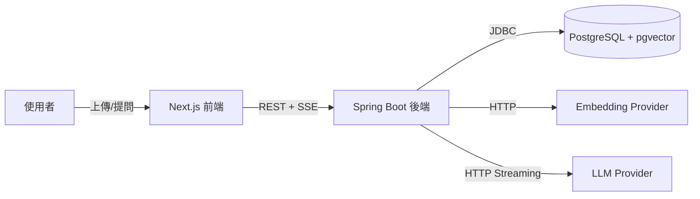

# RAG 文件問答系統 — 技術規格書（SPEC）

> 本文件為**可直接餵給 AI 編碼工具的規格書**。撰寫原則：明確邊界、明確介面契約、明確驗收標準，避免模糊指令導致 GIGO。
> 使用方式：將本檔（或相關章節）作為 context 提供給 AI，搭配 `Role × Task × Constraint` 框架下指令。例如「你是資深 Spring Boot 工程師（Role），依本 SPEC 的第 4 節實作文件處理管線（Task），必須遵守第 3 節的介面契約與第 7 節的限制（Constraint）」。

---

## 1. 專案目標（Goal）

建立一個文件知識庫問答應用：使用者上傳文件，系統將其向量化儲存，使用者以自然語言提問，系統檢索相關片段並由 LLM 生成串流回答。

**設計訊號**：展現後端工程深度與 AI 基礎建設整合能力。後端為核心，前端保持輕薄。

**非目標（Out of Scope）**：
- 不做多租戶 / 組織層級權限（單一使用者或簡單帳號即可）。
- 不做進階前端互動（無需複雜狀態管理、動畫）。
- 初期不上專用向量資料庫（用 pgvector，理由見決策記錄）。
- 不做行動 App。

---

## 2. 系統邊界與技術棧（System Context）

| 層 | 技術 | 職責 |
|----|------|------|
| 前端 | Next.js (App Router) | 文件上傳介面、問答對話框、SSE 串流顯示。**刻意保持薄。** |
| 後端 | Spring Boot 4.1.0 (Java 21) | 業務邏輯、檢索編排、串流控制、管線協調。詳見環境建置指南。 |
| 資料層 | PostgreSQL 16 + pgvector | 關聯資料 + 向量儲存（同一個庫） |
| 快取/限流 | Redis | embedding/結果快取、Bucket4j 限流狀態（見 ADR-009） |
| Embedding | 外部 API（OpenAI text-embedding-3-small, 1536 維）或本機 Ollama（nomic-embed-text, 768 維） | 文字向量化。維度依模型而定，須與 schema 對齊。 |
| LLM | 外部 API（OpenAI / Claude）或本機 Ollama（Gemma 4 E4B 等小模型） | 答案生成。開發期建議用雲端 API，詳見 ADR-008。 |
| 整合層 | Spring AI | 處理 embedding / 向量庫 / LLM 的 provider 整合。作為 adapter 層實作，領域層保留自有介面，詳見 ADR-007。 |

**系統邊界圖（Mermaid）**：



**介面邊界原則**：Embedding Provider、向量儲存、LLM Provider 三者皆透過介面抽象，可替換。

---

## 3. 介面契約（Interface Contracts）

> 此節為 AI 實作時必須遵守的契約。所有實作以介面為準，不得繞過抽象直接耦合具體 provider。

### 3.1 核心介面

```java
// Embedding 抽象 — 可替換 OpenAI / Ollama
public interface EmbeddingProvider {
    float[] embed(String text);
    List<float[]> embedBatch(List<String> texts);
    int dimensions();
}

// 向量儲存抽象 — 初期 pgvector，未來可換 Qdrant
// search 帶 documentScope（防線 2：scope 過濾）與 minSimilarity（防線 1：檢索門檻）
public interface VectorStore {
    void upsert(List<DocumentChunk> chunks);
    // documentScope：限定檢索範圍（null = 全部）；minSimilarity：低於此相似度的片段丟棄
    List<RetrievedChunk> search(float[] queryVector, int topK, String documentScope, double minSimilarity);
}
// RetrievedChunk 須包含 similarity 分數，供門檻判斷與後處理驗證使用。

// LLM 抽象 — 支援串流
// 串流回傳型別刻意不綁定 Flux（響應式）。已定案：串流端點用 Spring MVC + SseEmitter（見 ADR-006）。
// 介面用 Consumer<String> 回呼保持中性，adapter 層把 token 餵進 SseEmitter。
public interface LlmProvider {
    void generateStream(String prompt, Consumer<String> onToken);  // 逐 token 回呼
    String generate(String prompt);                                 // 非串流版本（測試用）
}

// 文件處理管線
public interface DocumentProcessor {
    ProcessingResult process(UploadedDocument doc);  // 解析→分塊→embedding→儲存
}
```

### 3.2 REST API 契約

| 方法 | 路徑 | 說明 | 請求 | 回應 |
|------|------|------|------|------|
| POST | `/api/documents` | 上傳文件 | multipart file | `{ documentId, status }` |
| GET | `/api/documents` | 列出文件 | - | `[{ documentId, name, status, chunkCount }]` |
| DELETE | `/api/documents/{id}` | 刪除文件 | - | `204` |
| POST | `/api/query/stream` | 串流問答（限流保護，超限回 429） | `{ question, documentScope? }` | SSE token 串流；知識庫無相關內容回固定訊息 |
| GET | `/api/query/history` | 查詢歷史 | - | `[{ question, answer, timestamp }]` |

### 3.3 資料模型

```sql
-- 文件主表
CREATE TABLE documents (
    id UUID PRIMARY KEY,
    name TEXT NOT NULL,
    status TEXT NOT NULL,        -- PENDING, PROCESSING, READY, FAILED
    chunk_count INT DEFAULT 0,
    created_at TIMESTAMPTZ DEFAULT now()
);

-- 文件片段 + 向量
CREATE TABLE document_chunks (
    id UUID PRIMARY KEY,
    document_id UUID REFERENCES documents(id) ON DELETE CASCADE,
    chunk_index INT NOT NULL,
    content TEXT NOT NULL,
    embedding vector(1536),       -- 維度依 embedding model 調整
    created_at TIMESTAMPTZ DEFAULT now()
);

-- 向量相似度索引
CREATE INDEX ON document_chunks USING hnsw (embedding vector_cosine_ops);

-- 查詢歷史
CREATE TABLE query_history (
    id UUID PRIMARY KEY,
    question TEXT NOT NULL,
    answer TEXT,
    retrieved_chunk_ids UUID[],
    token_cost INT,
    latency_ms INT,
    created_at TIMESTAMPTZ DEFAULT now()
);
```

---

## 4. 功能規格（Functional Spec）

### 4.1 文件處理管線

輸入：上傳的文件（PDF 或 Markdown）。
流程：
1. **解析**：抽取純文字。PDF 用 Apache PDFBox，Markdown 直接讀取。
2. **分塊（Chunking）**：預設固定大小分塊，chunk size 512 token、overlap 64 token。分塊策略須可設定（為後續實驗語意分塊預留）。
3. **Embedding**：對每個 chunk 呼叫 `EmbeddingProvider.embedBatch()`，批次處理。
4. **儲存**：寫入 `document_chunks`，更新 `documents.status = READY`。

錯誤處理：任一步失敗，`status = FAILED`，記錄原因。

### 4.2 查詢流程

輸入：使用者問題（可選 documentScope 限定範圍）。
流程：
0. **限流檢查（前置）**：查 Bucket4j/Redis，超過每 IP 或全域上限則回 429，不進入後續（見 ADR-009）。
1. 問題向量化：`EmbeddingProvider.embed(question)`。
2. 向量檢索：`VectorStore.search(vector, topK=5, scope, minSimilarity)`，cosine 相似度。scope 限定資源範圍（防線 2），minSimilarity 為檢索門檻（防線 1）。
3. **門檻判斷**：若檢索結果為空（全部低於門檻），直接回「文件中找不到相關資訊」，不呼叫 LLM。這同時省成本又防幻覺。
4. 組裝 prompt：將檢索到的 chunks 作為 context 填入 prompt 模板（防線 3）。
5. LLM 串流生成：`LlmProvider.generateStream(prompt, onToken)`，adapter 把 token 餵進 SseEmitter 回傳前端。
6. **後處理驗證（可選）**：檢查答案標註的引用片段是否存在於檢索結果（防線 4）。
7. 記錄：寫入 `query_history`（含延遲、token 成本、引用的 chunk）。

> grounding 四層防線詳見 ADR-010。防線 1+2 控制 LLM 看得到什麼，防線 3+4 控制怎麼用。

### 4.3 Prompt 模板（基準版）

```
你是一個文件問答助手。僅根據以下提供的文件片段回答問題。
若片段中沒有足夠資訊，明確說明「文件中找不到相關資訊」，不要編造。

【文件片段】
{retrieved_chunks}

【問題】
{question}

【回答】
```

---

## 5. 分階段交付（Milestones）

> 每階段為一個 GitHub 里程碑，含可驗證的 deliverable 與 README 設計決策說明。

### Milestone 1：最小端到端管線
- 能上傳一份文件、解析、分塊、embedding、存入 pgvector。
- 能對該文件提問，取得**非串流**答案。
- 驗收：上傳一份 PDF，問一個問題，回傳合理答案。

### Milestone 2：串流 + 多文件
- 問答改為 SSE 串流回傳。
- 支援多份文件，查詢可限定 documentScope。
- 驗收：答案逐字串流顯示；能跨多份文件檢索。

### Milestone 3：檢索品質 + 可觀測性
- 加入 reranking 或混合檢索（向量 + 關鍵字）。
- 接 OpenTelemetry，追蹤每次查詢的延遲分解（embedding / 檢索 / LLM 各佔多少）。
- 驗收：能在 trace 上看到單次查詢的延遲瀑布圖。

### Milestone 4：可靠性 + 成本控制
- LLM API 失敗的重試與降級策略。
- Embedding 快取、相同問題結果快取 + 失效策略。
- 每次查詢的 token 成本估算並記錄。
- 驗收：模擬 LLM API 失敗能正確降級；重複問題命中快取。

---

## 6. 驗收標準（Acceptance Criteria）

- [ ] 所有 provider 透過介面抽象，切換 OpenAI ↔ Ollama 僅需改設定，不需改業務邏輯。
- [ ] 文件處理管線各步驟可獨立測試（單元測試覆蓋分塊邏輯、prompt 組裝）。
- [ ] 串流回應在前端逐字顯示，無明顯卡頓。
- [ ] 向量檢索 top-k 結果與問題語意相關（人工抽查）。
- [ ] query_history 完整記錄延遲分解與 token 成本。
- [ ] README 說明每個 Milestone 的關鍵設計決策與權衡。

---

## 7. 限制與約束（Constraints）

> AI 實作時必須遵守。

- **語言/框架**：Java 21、Spring Boot 3.x。前端 Next.js + TypeScript。
- **不引入非必要依賴**：每個第三方函式庫須有明確理由。
- **介面優先**：禁止在 service 層直接 new 具體 provider，一律依賴注入介面。
- **可測試性**：業務邏輯與外部 IO 分離，外部呼叫可 mock。
- **不過度設計**：初期不做分散式、不做訊息佇列，保持單體。
- **錯誤透明**：失敗須記錄可診斷的原因，不吞例外。
- **成本意識**：embedding 與 LLM 呼叫須批次化、可快取，避免重複呼叫。

---

## 8. 架構決策記錄（ADR 摘要）

> 完整內容見 [ADR.md](ADR.md)，每則含 Context / Decision / Consequences / Alternatives 與面試敘事。

| ADR | 決策 | 選擇 | 權衡 |
|-----|------|------|------|
| 001 | 向量儲存 | pgvector（非專用向量庫） | 超大規模時不如 Qdrant；介面已抽象可換 |
| 002 | ANN 索引 | HNSW（非 IVFFlat） | 建索引較慢較吃記憶體；查詢效能較佳 |
| 003 | 串流協定 | SSE（非 WebSocket） | 不支援雙向；本場景不需要 |
| 004 | 分塊策略 | 固定大小 + overlap | 可能切斷語意；M3 再實驗語意分塊 |
| 005 | Provider 抽象 | 三介面隔離（DIP） | 多一層抽象；換取可測試與可替換 |
| 006 | 串流並發模型 | MVC + SseEmitter 起步 | 高並發時須評估 WebFlux 或虛擬執行緒 |
| 007 | Spring AI | 作 adapter 層，領域層保留自有介面 | 多一層包裝；守住領域邊界 |
| 008 | 本機 LLM 策略 | embedding 本機、生成開發期用雲端 | 開發期生成仰賴雲端；受限於硬體 |
| 009 | 速率限制 | Bucket4j 分層 + 全域上限 + 存取碼 | 存取碼降便利；護成本與防濫用 |
| 010 | 回答接地 | 四層 grounding（門檻/scope/prompt/驗證） | 門檻需調校；確保回答鎖在知識庫內 |
